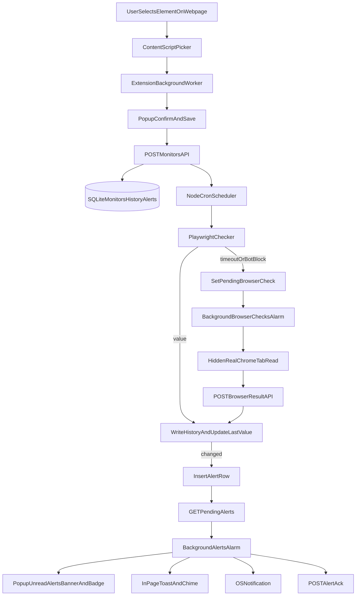

# Page Change Monitor!

## Technical Product Development Spec

## 1) Product Overview

`Page Change Monitor` is a local-first monitoring product that lets a user select a DOM element on any webpage, persist that element as a monitor, and receive alerts when the observed value changes.

The system is intentionally split into two runtime components:

- **Chrome extension**: Handles user interaction, in-page selection, local notifications, and alert presentation.
- **Local Node.js service**: Owns monitor persistence, scheduling, history, and change detection logic.

This split keeps browser UI responsive while moving long-running and stateful operations (scheduler, database, scraping/checking) into a dedicated local service process.

## 2) What Has Been Implemented (Completed Work)

### 2.1 Extension Platform and Permissions

Implemented in `extension/manifest.json`:

- MV3 service worker architecture with `background.js`.
- Popup entrypoint wired to `popup/popup.html`.
- Content script injection on `<all_urls>` via `content.js`.
- Required permissions for storage, tabs, notifications, alarms, and script execution.
- Host permissions for both arbitrary sites and local service access (`http://localhost:3579/*`).

### 2.2 Element Picker and In-Page UX

Implemented in `extension/content.js`:

- Interactive picker mode with hover overlay and selector label.
- Selector generation strategy:
  - Prefer unique `id`.
  - Otherwise prefer a uniquely identifying class segment.
  - Fallback to DOM path with `:nth-of-type(...)`.
- Value extraction from `innerText`, `value` attribute, or `content` attribute (capped length).
- Picker lifecycle controls:
  - activation from extension command,
  - click-to-select and send payload (`selector`, `value`, `url`, `pageTitle`),
  - `Escape` to cancel.
- In-page toast notifications with animated card + progress bar and audio chime for change events.

### 2.3 Popup Application (Monitor Management UI)

Implemented in `extension/popup/popup.html` and `extension/popup/popup.js`:

- Multi-section UI flow:
  - monitor list,
  - confirm-selection form,
  - monitor history view.
- Service health indicator (online/offline dot from `/health`).
- Monitor creation flow:
  - receives pending selected element from session storage,
  - captures user label + interval,
  - submits monitor to service.
- Monitor list capabilities:
  - render current value and relative last-checked time,
  - delete monitor,
  - trigger immediate check (`Now`),
  - open history.
- Immediate check UX:
  - fire-and-forget check request,
  - polling monitor data until fresh `last_checked`,
  - success/fallback button state handling.
- Alerts banner in popup:
  - displays unread changes,
  - supports dismiss per alert row,
  - synchronizes extension badge count.
- Output sanitization helper (`esc`) applied before HTML injection for dynamic values.

### 2.4 Background Service Worker Orchestration

Implemented in `extension/background.js`:

- Message bus bridging popup/content script to local service APIs.
- Handles monitor CRUD, history retrieval, health checks, and immediate checks.
- Maintains pending picked element in session storage and opens popup for confirmation.
- Alarm-driven periodic jobs:
  - **browser-checks alarm**: pulls monitors pending browser-assisted checks and executes them in real Chrome tabs.
  - **poll-alerts alarm**: fetches unacknowledged alerts, stores unread alerts locally, sets red badge, displays in-page toasts, emits OS notifications, and acknowledges alerts back to service.
- Browser-assisted fallback execution:
  - opens hidden tab,
  - waits for load + SPA settle delay,
  - polls selector for value,
  - posts result (`value` or `error`) back to service,
  - closes tab reliably in `finally`.

### 2.5 Local Service Runtime and API

Implemented in `service/index.js` and `service/api.js`:

- Express server bound to `127.0.0.1:3579` (localhost-only exposure).
- Startup behavior loads active monitor schedules.
- CORS-enabled JSON API consumed by extension.
- Implemented endpoints:
  - `GET /health`
  - `GET /monitors`
  - `POST /monitors`
  - `DELETE /monitors/:id`
  - `POST /monitors/:id/check`
  - `GET /monitors/pending-browser-checks`
  - `POST /monitors/:id/browser-result`
  - `GET /monitors/:id/history`
  - `GET /alerts/pending`
  - `POST /alerts/:id/ack`

### 2.6 Persistence Model (SQLite)

Implemented in `service/db.js`:

- SQLite DB at `~/.page-monitor/data.db`.
- WAL mode and foreign-key enforcement enabled.
- Core tables implemented:
  - `monitors`
  - `history`
  - `alerts`
- Idempotent migration logic for additional monitor fields:
  - `pending_browser_check`
  - `check_method`

### 2.7 Scheduler and Change Detection

Implemented in `service/scheduler.js` and `service/checker.js`:

- `node-cron` scheduling per monitor interval with in-memory job registry.
- Interval-to-cron conversion including sub-minute support for test cadence.
- `runCheck` workflow:
  - evaluate target selector via Playwright-based checker,
  - compare with last persisted value,
  - write history,
  - update monitor value,
  - emit alert row on change.
- Bot/timeout fallback path:
  - on timeout-like errors, flag monitor for browser-assisted extension check.
- Checker browser strategy:
  - try attach to existing Chrome over CDP (`localhost:9222`),
  - fallback to `channel: chrome`,
  - final fallback to Playwright Chromium.
- Browser context re-use and webdriver-hardening init script included.

### 2.8 Test Harness Page

Implemented in `test-page/index.html`:

- Rich synthetic values for price, stock, availability, countdown, rating, shipping.
- Manual controls to deterministically mutate values.
- Embedded activity log to verify monitor-triggered changes during development.

## 3) System Architecture and Data Flow

## 4) API Surface and Contracts

### `GET /health`

- **Purpose**: service liveness for popup status dot.
- **Response**: `{ "ok": true }` on healthy service.

### `GET /monitors`

- **Purpose**: list monitors with computed `last_checked`.
- **Response**: array of monitor rows including metadata and latest check timestamp.

### `POST /monitors`

- **Purpose**: create monitor and schedule it.
- **Request**: `label`, `url`, `selector`, optional `interval_minutes`, optional `last_value`.
- **Validation**: `label`, `url`, `selector` required.
- **Response**: created monitor row.

### `DELETE /monitors/:id`

- **Purpose**: remove monitor and unschedule.
- **Response**: `{ "ok": true }`.

### `POST /monitors/:id/check`

- **Purpose**: trigger immediate check (outside cron cadence).
- **Response**: `{ "ok": true, "last_value": ... }` or error payload.

### `GET /monitors/pending-browser-checks`

- **Purpose**: provide monitors flagged for browser-assisted fallback checks.
- **Response**: array of monitor descriptors (`id`, `label`, `url`, `selector`).

### `POST /monitors/:id/browser-result`

- **Purpose**: ingest browser-assisted check output from extension.
- **Request**: `{ value, error }`.
- **Behavior**:
  - always clears pending flag,
  - writes history + value updates on success,
  - writes alert row when a change is detected.

### `GET /monitors/:id/history`

- **Purpose**: fetch recent check history.
- **Response**: latest up to 100 rows sorted descending by check time.

### `GET /alerts/pending`

- **Purpose**: fetch unacknowledged alerts with monitor label.
- **Response**: joined `alerts + monitors` rows.

### `POST /alerts/:id/ack`

- **Purpose**: mark alert as acknowledged.
- **Response**: `{ "ok": true }`.

## 5) Operational Model

### Runtime and Dependencies

- Service uses Node with experimental sqlite flag:
  - from `service/package.json`: `node --experimental-sqlite`.
- Core dependencies:
  - `express`, `cors`, `node-cron`, `playwright`.
- Extension requires MV3 and local host permissions from manifest.

### Execution Model

- User interacts only through extension popup + in-page picker.
- Service runs continuously on localhost and owns persistent state.
- Scheduler executes periodic checks independently of popup visibility.
- Extension background worker periodically polls for:
  - pending browser fallback tasks,
  - pending alerts to present and acknowledge.

### Security Posture (Current)

- Service binds to `127.0.0.1` only, reducing network exposure by default.
- Extension sanitizes user-visible dynamic content in popup/toast rendering.
- No authentication layer exists because current architecture assumes local-only single-user operation.

## 6) Known Constraints and Risks

1. **Service Availability Dependency**
   - Extension features degrade when local service is offline.
   - Current behavior mostly surfaces offline state and fails gracefully, but functionality is service-dependent.

2. **Selector Fragility**
   - Generated selectors can break as page DOM evolves.
   - Monitors may silently stop matching until browser-assisted or manual re-selection is done.

3. **Anti-bot and Dynamic Site Variability**
   - Headless checks may fail on protected/dynamic pages.
   - Browser-assisted fallback improves reliability but adds complexity and latency.

4. **Alert Throughput and Deduplication**
   - Unread alerts are merged locally and surfaced in popup/banner.
   - Without additional dedupe controls, noisy monitors can produce repetitive alert volume.

5. **Local-Only Assumptions**
   - Architecture and threat model are optimized for personal/local usage.
   - Multi-user, shared-host, or remote deployments are not currently addressed.

## 7) Next Development Priorities

1. **Reliability Hardening**
   - Add structured retry/backoff and explicit error categorization for checker and browser-assisted paths.
   - Persist check failure telemetry for diagnostics.

2. **Selector Robustness**
   - Expand selector strategy to include additional stable attributes and fallback chains.
   - Capture selector quality metadata at creation time.

3. **Alert Noise Controls**
   - Add per-monitor cooldown/debounce options and optional threshold-based change filtering.
   - Improve deduplication semantics between popup unread state and server-side acknowledgments.

4. **Testing Strategy**
   - Add automated unit/integration tests around:
     - scheduler change detection behavior,
     - API contracts,
     - selector generation edge cases.
   - Add deterministic end-to-end flow against the test page for CI confidence.

5. **Operational Packaging**
   - Document and automate local bootstrap (service + extension load) for repeatable onboarding.
   - Define release/versioning workflow across extension and service components.

6. **Security Evolution Path**
   - If future deployment extends beyond localhost, introduce authN/authZ and stricter CORS/host controls.
   - Add explicit trust-boundary documentation for extension-service communication.
